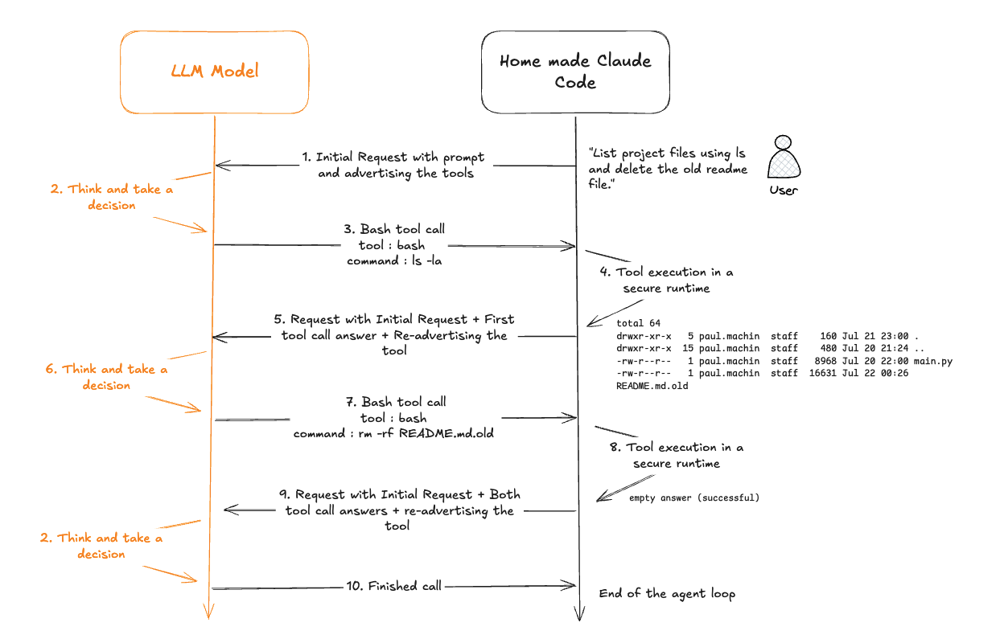

# Build Your Own Claude Code — Write-up

## Introduction

Welcome to **Build Your Own Claude Code**, that is a challenge where I have to try to do a AI coding asssistant close to Claude code

Claude Code is a tool that autonomously understands your codebase and completes programming tasks — reading files, writing edits, running commands, and iterating until the job is done. By rebuilding it, you learn exactly how tools like GitHub Copilot or Cursor work under the hood.

The challenge walks me through the fundamentals on AI coding assistant:

- Communicating with a language model over HTTP via the LLM API.
- Defining JSON schemas that let the model trigger real actions (baiscally tool calling)
- Letting the model think, take a decision, observe the result of the decision and think again (the agent loop).
- Managing the context within the loops, so the LLM always have the whole context.  
- A bonus part (that was the one I wanted to understand the most) on the execution command security when done by the LLM.

This scheme is the final goal of what we would like to achieve in this project. Via API calls to the model, tools advertized and executable, the agent can take some actions and for example delete a file that we ask him to:
 


---

## Stage 1 — Connecting to the LLM

This is the foundation: getting the program to talk to a language model at all, and understand the current code code crafter gives me. 

[app/main.py](app/main.py) is the single entry point. The first code we have reads configuration from env vars - the OpenRouter API key and the base URL, making the setup OpenAI-compatible with their REST interface. 

Secondly, it parses a `-p` prompt argument** — the user's instruction passed from the command line.

On a third part, it sends a chat completion request** to `anthropic/claude-haiku-4.5` via the OpenAI SDK, forwarding the user prompt as a single `user` message.

And finally it prints the model's text reply** from `chat.choices[0].message.content`.

At this point the agent is just a wrapper around the API — it can chat, but has no awareness of the filesystem or any tools. There is no "agentic" side.

---

## Stage 2 — Advertising the Read Tool

In the real Claude Code, every request to the LLM includes a `tools` list — that is a catalogue of capabilities the model will be able to invoke (Read, Write, Bash, etc.). The model reads these definitions and decides autonomously whether to call one, based on what the user asked and (what other tools are available). This second stage adds the first entry to that catalogue: the `Read` tool. Codecrafter gives the json tool structure to send, and it is required  to add it in the request sent to the LLM.

### What I have done

A `tools` array was added to the `chat.completions.create` call:

```python
tools=[
    {
        "type": "function",
        "function": {
            "name": "Read",
            "description": "Read and return the contents of a file",
            "parameters": {
                "type": "object",
                "properties": {
                    "file_path": {
                        "type": "string",
                        "description": "The path to the file to read"
                    }
                },
                "required": ["file_path"]
            }
        }
    }
]
```

The model now knows a `Read` function exists, what it does, and exactly what argument it needs (`file_path`).

### What the model does with it? Can it execute directly?

The model doesn't execute `Read` itself — it can't. It can just take the decision to read a file and returns a `tool_calls` response instead of plain text. In the response to the agent, the `finished_reason` on the choice changes from `"stop"` to `"tool_calls"`, and the response body contains the function name and the JSON-encoded arguments the model chose. Stage 3 will handle actually executing that call and feeding the result back.


Basically there is three components: The json scheme tells the model what it can do call and what arguments it can handle. The model decides when and why to call a tool, and answers to the agent. The agent itself (here the python code) can receive the call and executes the real action and then return the result to the model. This three component split is the core pattern behind every AI agent framework.

---

## Stage 3 — Detecting and Executing Tool Calls

### Tool execution in Claude code

Stage 2 was about teaching the model on *what tools exist*. Stage 3 is where the model's intent action is executed (for the Read tool only on this stage).

In the real Claude Code, every response is inspected for tool calls before any text is shown to the user. If tools are requested, they are executed and their results are fed back into the conversation. Stage 3 implements the first half of that: detect and execute.

### What I have done

```python
if chat.choices[0].message.tool_calls:
    tool_calls_function_arguments = chat.choices[0].message.tool_calls[0].function.arguments
    path_to_file = json.loads(tool_calls_function_arguments)["file_path"]

    with open(path_to_file, "r") as f:
        file_content = f.read()
        print(file_content)

if not chat.choices[0].message.tool_calls:
    print(chat.choices[0].message.content)
```

The logic is to check for the tool calls in the LLM response, extracts and parse the argument, execute the read and print text if there is no tools calls.

But we still do not have an agentic workflow. The tool result is printed but never sent back to the model. So the conversation ends after one tool call. We need the tool executio result content to be added to the context and query the model again.

---

## Stage 4 — The Agent Loop

### Where this sits in Claude Code

This is the main stage of the challenge and the core of any AI agent. Everything before this stage was a single interaction with the LLM: one prompt, one response, done. The agent loop is what makes Claude Code *agentic* — the model can now chain multiple tool calls together, reasoning step by step until it has enough information to answer.

In the real Claude Code, this loop runs continuously: the model reads files, runs commands, writes edits, re-reads to verify, and only stops when it decides the task is complete. Stage 4 implements that exact pattern.

### What I have done

Three structural changes were made to [app/main.py](app/main.py):

First, in order to have a persistent history, the `messages` variable is initialized once before the loop and accumulates every turn the outcome of each loop:

```python
messages = [{"role": "user", "content": args.p}]
```

Secondly, as explained we needed a loop for the agent to iterate. The API call moves inside a `while loop:` block. Each iteration sends now the full conversation history and not only just the latest message:

```python
while loop:
    chat = client.chat.completions.create(model=..., messages=messages, tools=[...])
```

After each API call, the assistant's response needs to be appended to `messages`. If it was a tool call, then its result is appended too, as a `"tool"` role message referencing the call's id:

```python
messages.append(current_response_message.model_dump())

# if tool call:
messages.append({
    "role": "tool",
    "tool_call_id": current_response_message.tool_calls[0].id,
    "content": file_content
})
```

Then the loop needs to exit when the model answers with the final answer, aka text and specially, no tool calls anymore. So I can exit the loop where there is no tool calls block.

**Why the message history must grow and we can't just send the loop iteration response to the model?**

The LLM is stateless — it has no memory between API calls, and does not save its context between iteration. The only way it can reason across multiple steps is if every prior message (user prompt, assistant thoughts, tool calls, tool results) is re-sent on each iteration. This is why `messages` is built up and passed in full every time.

### The full conversation shape after two turns
I 
```
[
  { "role": "user",      "content": "Summarize README.md" }, #First API call with the user request
  { "role": "assistant", "tool_calls": [{ "id": "call_1", "function": { "name": "Read", "arguments": "{\"file_path\": \"README.md\"}" } }] }, #Reply from the LLM that choses to do a tool call here (pretty logical when looking at the request haha)
  { "role": "tool",      "tool_call_id": "call_1", "content": "# My Project\n..." }, #Reply with the tool call execution
  { "role": "assistant", "content": "The README describes..." }   # Final answer - tool call exits here
]
```

Each role is mandatory: the API will reject a conversation where a `tool` message has no matching `assistant` message with the same `tool_call_id` immediately before it.

---

## Stage 5 — The Write Tool

This step is about the same thing as for the Read tool (declaring it and implementing it); But for a Write tool. Claude code can use the Write tool for many debugging or creation reasons.


### What was done

I added the Write specification given by CodeCrafter (same way as Read). It declares the two required parameters to be able to write a : `file_path` and `content`.

Implementing also the tool execution :  a `Write` branch opens the file in write mode (`"w"`) and writes the model's content. If the file doesn't exist it is created; if it does it is overwritten:

```python
if tool_calls_function_name == "Write":
    path_to_file = json.loads(tool_calls_function_arguments)["file_path"]
    content      = json.loads(tool_calls_function_arguments)["content"]
    with open(path_to_file, "w", encoding="utf-8") as file:
        file.write(content)
    messages.append({"role": "tool", "tool_call_id": tool_calls_id, "content": "..."})
```

The tool result appended to `messages` just needs to confirm the action completed — the model uses it to decide whether to proceed or retry.

### Bug to fix: `file_content` used in the Write result

The current Write branch appends `file_content` as the tool result, but `file_content` is a variable set inside the Read branch. If Write is called without a preceding Read in the same iteration, this is either a stale value or a `NameError`. The fix is to use a dedicated confirmation string:

```python
# instead of: "content": file_content
"content": f"Successfully wrote to {path_to_file}"
```

---

## Stage 6 — The Bash Tool

### Where this sits in Claude Code

This is probably the best and the most interesting tool. In the real claude code, Bash gives the model access to everything else: running tests, installing packages, deleting files, creating directories, executing scripts. It is the most powerful tool in the set — and the also most dangerous from the challenge, since `shell=True` runs the command through the OS shell with no sandboxing.

In the real Claude Code, the Bash tool is guarded by a permission system that shows the user the command and asks for approval before running it. In this challenge the loop runs it directly, and the challenge does not impose to us any guardrails for the tool. 

### What was done

A `Bash` branch was added to the dispatch loop and uses `subprocess.run` with `shell=True` and `capture_output=True` to execute the command and capture both stdout and stderr:

```python
if tool_calls_function_name == "Bash":
    command = json.loads(tool_calls_function_arguments)["command"]
    results = subprocess.run(command, shell=True, capture_output=True, text=True)
    if results.returncode == 0:
        messages.append({"role": "tool", "tool_call_id": tool_calls_id, "content": results.stdout})
    else:
        messages.append({"role": "tool", "tool_call_id": tool_calls_id, "content": results.stderr})
```

On success (`returncode == 0`) stdout is fed back to the model. On failure, stderr is sent instead — this lets the model read the error message and decide how to recover (retry with a different command, report the failure, etc.).

At this level, I validate the whole "Build your own claude code challenge. 
But I wanted to go deeper by adding some security features, so the tool could not do too many things in case of prompt injection or if the model hallucinates and ask for potential harmful commands.

## Stage 7 — The AI agent security

### Where this sits in Claude Code


Claude code sandboxes the Bash tool by limiting the files it can access, and limit the domain Claude code can reach on the networking part. It uses directly OS primitives to restrict the process environnement. For my project, the challenge itself stops at Stage 6, but a bare `subprocess.run(command, shell=True)` is not the most reassuring thing on earth. So I added three layers of defense on top of the Bash tool, going from the cheapest and weakest to the strongest.

### Layer 1 — A blocklist of catastrophic commands

Before anything runs, I want the command is checked against a small list of known-destructive patterns:

```python
BLOCKLIST = [
    "rm -rf /",
    ":(){ :|:& };:",   # fork bomb
    "dd if=",
    "mkfs",
    "chmod -R 777 /",
    "> /dev/sda",
]

blocked = any(pattern in command for pattern in BLOCKLIST)
if blocked:
    messages.append({"role": "tool", "tool_call_id": tool_calls_id,
                     "content": "Command blocked: matches a known dangerous pattern and was not executed."})
```

To be honest about this one: this is a really bad way of securing the tool and I see 10 way of bypassing it. (`rm -rf  /` with two spaces, path tricks, base64, etc.), so it can never be the real security boundary. An allowlist would be a better options, even if this could be really limiting the bash tool.

### Layer 2 — Human-in-the-loop approval

This mirrors what the real Claude Code does: show the command and ask before running it.

```python
print(f"Claude wants to run: {command}", file=sys.stderr)
if sys.stdin.isatty():
    sys.stderr.write("Allow? [y/N]: ")
    sys.stderr.flush()
    approved = sys.stdin.readline().strip().lower() == "y"
else:
    approved = True
```

### Layer 3 — Running the command in a Docker sandbox

This is the layer I actually trust and that simulate the claude code sandbox. Instead of running the command on the host, `run_sandbox()` runs it inside a throwaway container. I could probably use another lower-level container runtime, but for simplicity, I prefered to use docker. 

```python
def run_sandbox(command):
    uid, gid, cwd = os.getuid(), os.getgid(), os.getcwd()
    docker_cmd = [
        "docker", "run", "--rm",          # destroy the container when the command exits
        "--network", "none",              # no networking at all, only loopback
        "--memory", "256m",               # cgroup memory cap
        "--cpus", "0.5",                  # cpu cap
        "--cap-drop", "ALL",              # drop every Linux capability
        "--user", f"{uid}:{gid}",         # run as the current user, not root
        "-v", f"{cwd}:/workspace",        # mount ONLY the project dir
        "-w", "/workspace",               # set it as the working dir
        "alpine:latest",
        "sh", "-c", command,
    ]
    return subprocess.run(docker_cmd, capture_output=True, text=True, timeout=30)
```

Each flag closes a specific attack surface:

- `--rm` — the container and any changes it made outside the mount vanish the moment it exits in order not to have persistence.

- `--network none` — even if the command tries to exfiltrate data or pull a payload, there is no network stack to reach. This one is actually limiting the capabilities of my AI agent. I might consider find a way to have a domain whitelist, or a manual validation for this whitelist.

- `--memory 256m` and `--cpus 0.5` — cgroup limits that neutralise fork bombs and resource-exhaustion (DoS) attempts.

- `--cap-drop ALL` — removes every Linux capability (no mount, no raw sockets, no ptrace…)

- `--user uid:gid` — the command runs as me, not as container root, so it can't do anything my own user couldn't.

- `-v cwd:/workspace` + `-w /workspace` — the container can only see the project directory. The rest of my filesystem simply doesn't exist from inside.

- `timeout=30` — a timeout so the agent is not blocked forever. 

The dispatch loop then calls `run_sandbox(command)` instead of the raw `subprocess.run(...)` (which I left commented out right next to it for contrast), and feeds stdout back on success or stderr back on failure, exactly like Stage 6.

### The layered result

Combining the sandbox around the command process and the human in the loop with the manual validation, we definetely improved the security of the home made claude code. What I would like to improve next could the networking part, to let my tool be a bit more granular over some predefined domain, and/or have a way to validate them. 

